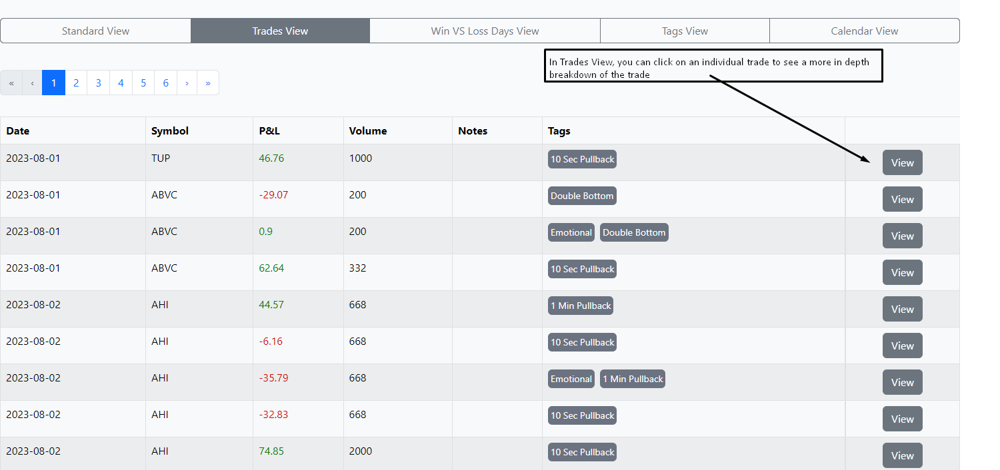

# Trade Tracker Frontend

This repository houses the frontend code for the Trade Tracker application, a comprehensive tool for tracking and analyzing trading activities. The application is built using React and designed to work seamlessly with its counterpart backend.

For a complete understanding and to explore the backend functionalities, check out the backend repository:

- **Trade Tracker Express Backend**: [Explore Backend Repository](https://github.com/Jas667/trade_tracker_express_backend)

This link provides direct access to the source code, documentation, and setup instructions for the backend part of the Trade Tracker application.


## Demo

- **Live Application:** [Trade Tracker on Railway](https://tradetrackerfrontend-production.up.railway.app/)
- **Test Account:**
  - Username: `TestUser`
  - Password: `adminadmin`

## Features

- **Trade Import:** Import trades from TradeZero using the provided excel sheet.
- **Trade Visualization:** View and analyze your trades in a user-friendly interface.
- **Custom Tags and Notes:** Enhance your trades with personalized tags, notes, and images.
- **Metrics Analysis:** Access a variety of filtered metrics for detailed insights.
- **Broker Compatibility:** Primarily supports TradeZero, with potential for easy integration of other brokers.

## Installation

At present the app is deployed to Railway, and the settings are currently set to allow for that deploy. If you wish to run this locally, you can simply run the following command:

```
npm run dev

```

The frontend will then be available at `http://localhost:5173/`. (Note: the backend must be running for the frontend to work.)

## Usage

The Trade Tracker application is designed to be intuitive and easy to use. The following steps will guide you through the process of importing trades and viewing them in the application.

### Trade Filter Bar


The trade filter bar is the main way to filter trades in the application. It is located at the top of the trade table and is always visible on pages where trades are visible. To view all trades within a date range, simply select the date range and leave all other fields blank.

### Views


The views menu allows you to analyse your trades in a variety of ways. The default view is standard. All displays offer different analytics on the same selection of trades. Some are self explanatory. For the others, which offer more complex/interactive analytics, I have shown them below.




### Trades View (After Clicking Into a Trade)


### Trade Upload


This is where you upload your trades data from TradeZero csv file. This can be attained in the 'Trades' menu at TradeZero. You can select a date range to download. Once uploaded to the application, you can view your trades in the 'Trades' menu. Trade executions will automatically be grouped into 'trades'.

### Tags Menu


This is where you can globally add/edit/delete tags. You can also add tags to individual trades in the 'Trades' view by clicking into individual trades.

## Contributing

Pull requests are welcome. For major changes, please open an issue first to discuss what you would like to change. This is my first time building with React, so I am sure there are many ways to improve the codebase. Build was used as a learning experience, so I am open to any and all suggestions.

## License

[MIT](https://choosealicense.com/licenses/mit/)

```
